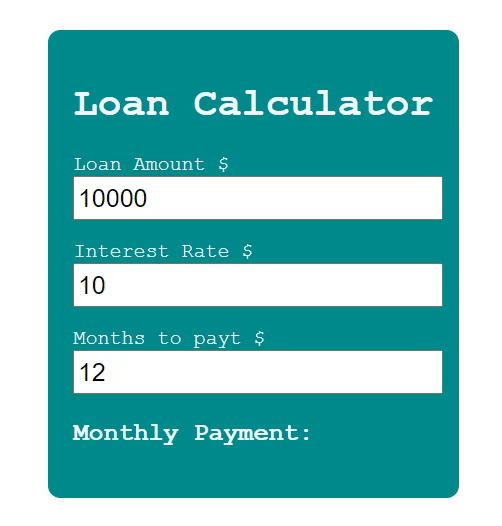

# Loan-Calculator


## 기능 
대출금 계산기 

(1) 대출 금액 입력    
(2) 이율 입력  
(3) 기간을 입력  
(4) 월마다 지불해야할 대출이자 금액 출력   

## 학습 
### 1. CSS : vw,vh
viewport란 화면 Display상의 표시 영역을 뜻한다.   
즉, vw와 vh는 __현재 실행중인 스크린 크기에 맞춰 상대적 크기를 반환__ 한다.

- vw = viewport width (화면기준으로 너비)  
- vh = viewport height (화면기준으로 높이)  

현재 실행된 디스플레이 스크린에 맞춰 상대적인 크기를 반환하여 보여준다.  
뷰포트(Viewport, 화면크기)를 기준으로 높이와 너비에 비례하기 때문에 반응형 웹을 구성하는데 유용한 단위

예)  
100vw, 100vh가 전체 화면의 기준이므로,   
현재 스크린의 크기가 width: 1200px, height: 900px 라고 가정을 하면   
*=> 1vw = 12px , 1vh = 9px*

 ```
 div {
	  width: 25vw;
    height: 50vh;
  }
 ```

실제로는 *width : 12*25 = 300px , height = 9*50 = 450px*로 계산 되어서 적용이 된다.   

### 2. JS : onchange 이벤트  
HTML 요소의 값이 변경 되면 이벤트 onchange가 발생   

__oninput__ 과 유사하나 차이점이 있다면, __onchange 이벤트가 `<select>` 요소에서도 작동__ 한다는 것입니다.

이벤트|의미|
---|---|
oninput|요소의 값이 변경된 직후에 발생|
onchange|내용이 변경된 후 요소가 포커스를 잃었을 때 발생

```
Enter your name: <input type="text" id="fname" onchange="myFunction()">

<script>
function myFunction() {
  var x = document.getElementById("fname");
  x.value = x.value.toUpperCase();
}
</script>
```

## 학습 출처
**유튜브**  
https://www.youtube.com/@JavaScriptKing

**CSS**  
https://bumday.tistory.com/99  
https://velog.io/@pixelstudio/CSS-vhvw%EC%99%80-%EC%9D%98-%EC%B0%A8%EC%9D%B4%EC%A0%90  

**JS**  
https://www.w3schools.com/jsref/event_onchange.asp  

**키워드**  
- vw, vh  
- onchange 
